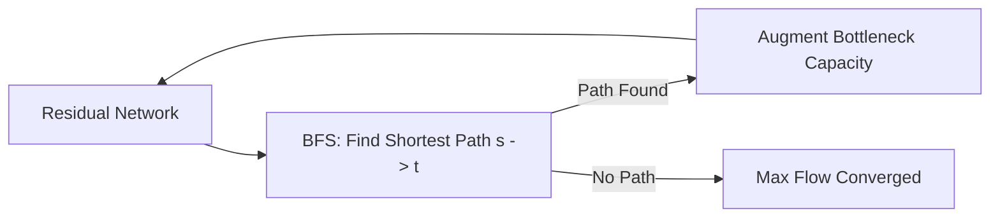

# Edmonds-Karp BFS Max Flow Algorithm Skill

Robust, zero-dependency Python implementation of the **Edmonds-Karp Algorithm** running in \(O(V E^2)\) time.

## Features
- **BFS Shortest Augmenting Path**: Guarantees polynomial convergence avoiding irrational flow divergence.
- **Residual Capacity Invariants**: Dual edge representation supporting backward cancellation flow.
- **Zero External Dependencies**: Pure Python standard library.
- **Native MCP Protocol**: JSON-RPC 2.0 stdio server compatible with Claude Desktop, Cursor, and Windsurf.

## Architecture

